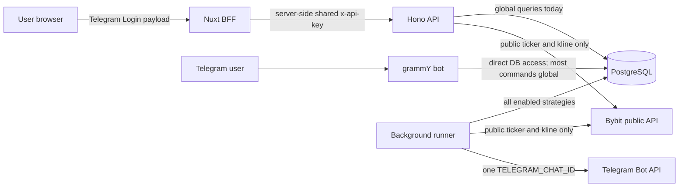

# Multi-user Bybit Safety Research

> Historical research snapshot. Source, provider capabilities and prices below retain their original dates. Current source state, product model and readiness are in [project status](23_PROJECT_STATUS.md); this dossier does not authorize private exchange work.

_Research snapshot: 2026-07-31. This document describes a future path; it is not evidence that private or live Bybit execution exists._

## Executive decision

The repository is suitable for a single-tenant `DRY_RUN` product, but it is not safe to expose as a hosted multi-user service yet. Telegram identity exists, but it is not propagated through the BFF and API data paths, ownership is incomplete in PostgreSQL, bot mutations are global, and runner notifications target one configured chat.

The implementation sequence must remain:

1. user isolation in `DRY_RUN`;
2. per-user Bybit Demo connections and reconciliation;
3. a small, explicitly opted-in live pilot with hard caps;
4. public SaaS only after operational and broker/onboarding requirements are met.

## Current trust-boundary map

### What is already sound

- Telegram Login payloads are verified server-side using the bot token and timing-safe hash comparison.
- The browser receives an HTTP-only session cookie; the service `API_KEY` remains server-side in the BFF.
- The runner forces `liveTradingEnabled: false` when calling RiskGuard.
- The Bybit adapter implements public ticker and kline reads only.
- Pending dry-run orders use a database-backed countdown and an atomic `PENDING` to `COMPLETED` claim.

### Missing trust links

- The Nuxt session user is not forwarded as a verified user context to ordinary API calls.
- The Hono API authenticates the BFF/service with one shared key, not the end user.
- API list and mutation routes query global tables.
- Bot commands generally do not resolve `ctx.from.id` to a database user before reading or mutating data.
- The runner cannot route an order notification back to the owning user's chat.
- No private Bybit credential or trading adapter exists, which is the correct current safety state.

## Tenant-isolation audit

| Surface | Current behavior | Multi-user consequence | Required invariant |
| --- | --- | --- | --- |
| `users` | Unique `telegram_user_id`; chat id stored | Useful identity anchor | Telegram user id maps to exactly one internal user |
| `strategies` | `user_id` is nullable; lookups often use only `symbol` | One user can read/change another user's strategy | `user_id NOT NULL`; uniqueness on `(user_id, symbol)`; every query scopes by user |
| `orders` | No `user_id`; optional unverified `strategy_id` | Ownership cannot be enforced efficiently or reliably | Non-null owner and strategy foreign keys; owner consistency enforced |
| `audit_events` | No owner column; payloads may contain full row snapshots | Global feed leaks activity and future exchange metadata | Immutable owner scope plus redacted structured payloads |
| Hono API | Shared `x-api-key`; data routes have no user principal | Service authentication is mistaken for user authorization | Verified short-lived internal user assertion on every user-data request |
| Nuxt BFF | Auth routes use session; ordinary handlers call API without reading it | Logged-out callers can reach the same global BFF data | Require session, derive user server-side, forward signed identity only |
| Telegram bot | `/start` upserts a user; status/settings/mutations are global | Any bot user can inspect or mutate shared data | Resolve the caller for every private command and scope all reads/writes |
| Onboarding | Finds an existing strategy by symbol only | User B can overwrite user A's strategy | Lookup and upsert by `(user_id, symbol)` |
| Order callbacks | Load by order id only; do not verify callback actor/chat | A forwarded or forged callback can mutate another order | Order owner must match `ctx.from.id`; use atomic state transition |
| Runner | Evaluates all enabled strategies; budgets are per strategy | No user-level budget or connection boundary | Carry owner and connection through decision, reservation, order, audit, notification |
| Telegram alerts | One environment `TELEGRAM_CHAT_ID` | All events go to one operator chat | Route through owner's stored chat id; classify delivery failures per user |
| PnL/performance/digest | Aggregate all completed orders | Cross-user financial/activity leakage | Every aggregate accepts a mandatory owner scope |
| Seed data | Creates enabled strategies with no owner | Legacy rows become ambiguous tenants | Assign to an explicit legacy/operator user; never silently clone to users |

## Immediate no-go findings

Until isolation is complete, do not:

- expose the dashboard as a public multi-user service;
- add a private Bybit order endpoint;
- store user exchange keys;
- enable `LIVE` strategies;
- reuse one master Bybit account or a pool of subaccounts for unrelated customers;
- describe the current product as executing live Bybit orders.

The current landing content contains claims that live trading uses user Bybit spot keys. That copy is aspirational and should be corrected before public acquisition traffic is sent to it.

## Bybit onboarding decision

The connection method is a phase decision, not one universal mechanism.

| Method | Appropriate phase | Benefits | Constraints and decision |
| --- | --- | --- | --- |
| User-created API key | Self-hosted or tightly assisted pilot | Available now; permissions and IP binding are visible | High-friction secret handoff; use only with a dedicated subaccount, never request a withdrawal/transfer permission |
| Bybit Demo key | First private-adapter integration | Isolated Demo UID; order and private-stream behavior resembles real trading | Use `api-demo.bybit.com`; Demo is not Testnet, retains orders for seven days, and does not support WebSocket Trade |
| API Broker OAuth | Public hosted SaaS target | User-approved redirect flow; avoids teaching users to paste long-lived keys into a form | Requires Bybit application/approval, Broker UID, registered redirect URIs, `client_id`/`client_secret`, CSRF `state`, token refresh, and secure recovery of returned OpenAPI credentials |
| AI Subaccount | Candidate for an isolated pilot, pending Bybit confirmation | API-only isolated account, user-visible controls, default asset cap, time-limited keys | Its advertised feature surface includes transfers, leverage, derivatives, and other products forbidden here; recurring hosted-bot and broker compatibility must be confirmed before adoption |

Recommendation:

- Implement the adapter against Bybit Demo first.
- For a 2–3-user live pilot, prefer a user-owned dedicated Standard or AI subaccount with a hard asset cap and a narrowly scoped key.
- Apply for API Broker access in parallel; make Broker OAuth the public SaaS target if Bybit approves the use case and region.
- Never accept an access token or API secret through Telegram/chat messages. The browser-to-BFF connection flow must transmit it directly over TLS and immediately encrypt it server-side.

## Minimum Bybit permission contract

A connection is `VERIFIED` only after its own credential calls `GET /v5/user/query-api` and all checks pass.

Required:

- read/write key (`readOnly = 0`) because a future adapter needs order creation;
- `permissions.Spot` contains only `SpotTrade`;
- no contract, derivatives, options, wallet transfer, withdrawal, earn, P2P, convert, card, affiliate, block-trade, or other product permission;
- dedicated subaccount preferred (`isMaster = false`); a main-account key is rejected for hosted live use;
- expected Bybit environment, account UID, parent UID, key type, region, and expiry recorded as non-secret metadata;
- production egress IP binding required for live pilot when supported; reject an expired key or one near expiry according to the operational policy;
- a regional Bybit API hostname selected explicitly from verified account region/configuration, never inferred from untrusted request input.

Connection verification must be read-only: check server time, key metadata, account identity, and balance visibility. It must not create a live “test order.” Re-run permission and expiry verification periodically and immediately before enabling a connection after rotation.

Suggested connection states:

`PENDING` → `VERIFYING` → `VERIFIED_DEMO` or `VERIFIED_LIVE`, with failure states `REJECTED_PERMISSIONS`, `EXPIRED`, `REVOKED`, `REGION_BLOCKED`, and `ERROR`. A failed or stale verification automatically disables execution but keeps non-secret audit evidence.

## Credential storage and lifecycle

Use a dedicated `exchange_connections` record per user and environment. Keep searchable metadata separate from an authenticated encrypted credential envelope.

Non-secret columns should include:

- internal id, `user_id`, exchange, environment, external UID/parent UID, and key type;
- permission snapshot and verification timestamp;
- IP-binding snapshot, expiry, status, last success/error class, and created/updated timestamps;
- encryption key version and credential fingerprint for duplicate detection without storing the key itself.

Secret material should be one versioned envelope containing only what the signer needs. Encrypt it with authenticated encryption such as AES-256-GCM. Bind `connection_id`, `user_id`, exchange, environment, and key version as additional authenticated data so ciphertext cannot be transplanted between tenants or environments.

Key-management rules:

- keep the master/key-encryption key in a managed secret/KMS boundary, never in PostgreSQL beside ciphertext;
- grant decrypt access only to the execution worker, not to web rendering, analytics, support tools, or ordinary API list routes;
- decrypt just in time, retain plaintext for the shortest practical lifetime, and never include it in errors, traces, audit payloads, fixtures, or telemetry;
- rotate with “new key writes, old key reads” during a bounded migration, then re-encrypt and retire the old version;
- on disconnect or suspected compromise, revoke upstream first, disable execution immediately, erase encrypted secret material, and retain an append-only non-secret tombstone/audit trail;
- alert on decrypt attempts, expired/revoked-key use, permission drift, and repeated signature failures without logging signed payloads or secrets.

## Execution-environment gates

An explicit third mode is safer than overloading `LIVE` with a Demo base URL. Before a private adapter is implemented, evolve the contract to distinguish `DRY_RUN`, `BYBIT_DEMO`, and `LIVE`.

| Gate | DRY_RUN | BYBIT_DEMO | Closed LIVE pilot | Public SaaS |
| --- | --- | --- | --- | --- |
| Exchange connection | None | Verified Demo | Verified dedicated live subaccount | Approved hosted onboarding |
| Real funds | No | No | Small user-funded cap | Per policy and user cap |
| System flag | Dry-run always available | Demo explicitly enabled | Global live flag and allowlisted user | Region/product rollout flag |
| User consent | Strategy enable | Demo disclosure | Versioned live opt-in with exact caps | Versioned terms plus per-strategy opt-in |
| Risk controls | Existing RiskGuard | Production-equivalent checks | Reservation, per-user/global caps, user/global kill switch | Same plus operational limits |
| Reconciliation | Internal state | Private WebSocket plus REST | Mandatory and continuously healthy | SLO-backed and alerted |
| Operations | Local observability | Failure-injection tests | Named operator and incident runbook | On-call, support, recovery drills |

Every gate is conjunctive: missing, stale, or contradictory state fails closed to “no submit.” Disabling live mode must stop new submissions without destroying order/audit history; already accepted exchange orders continue through reconciliation.

## Private order contract and lifecycle

The private adapter must expose a narrow domain operation such as “buy an allowed spot symbol for this quote amount.” It must not accept arbitrary Bybit request objects from callers.

The adapter always constructs:

- `category=spot`;
- `side=Buy`;
- `orderType=Market`;
- `marketUnit=quoteCoin`;
- `isLeverage=0`;
- `orderFilter=Order`;
- a unique `orderLinkId` no longer than 36 characters.

Before reservation/submission, fetch or use a short-lived cache of `GET /v5/market/instruments-info` and verify `status=Trading`, the product allowlist, quote precision, `minOrderAmt`, and current market-order limits. Bybit documents that some instrument limits change periodically, so these values must not be hardcoded into strategy defaults.

Recommended lifecycle:

1. Persist the signal and RiskGuard decision.
2. In one database transaction, reserve the user's spend budget and insert an internal order with a unique `orderLinkId` and state `SUBMITTING`.
3. Submit exactly once for that idempotency key.
4. Treat the REST response only as `ACCEPTED`, never as `FILLED`.
5. Consume both `order.spot` and `execution.spot`; deduplicate executions by `execId` and aggregate quantity, value, and fees.
6. Transition through `ACCEPTED`, `PARTIALLY_FILLED`, `FILLED`, `CANCELLED`, or `REJECTED` using monotonic/idempotent reducers.
7. If the submit response is lost or streams are unavailable, mark `UNKNOWN`; do not blindly resubmit. Query order/execution history by `orderLinkId`, then settle or release the reservation.
8. Run periodic reconciliation after reconnect/restart and before reporting balances/PnL as current.

The state reducer must tolerate duplicate and counterintuitive WebSocket messages; Bybit explicitly documents that two `Filled` messages can occur during an order/cancel race. Store raw exchange ids and normalized facts, but redact secrets and avoid dumping complete upstream payloads into general logs.

## Rate-limit and connection architecture

The current runner already fetches one ticker per unique symbol during each tick. Preserve and formalize that pattern:

- one public market-data fetch/stream per symbol, shared by all tenants;
- one bounded private connection context per Bybit UID/connection, with reconnect backoff and subscription recovery;
- queues partitioned by connection/UID so one noisy user cannot starve others;
- endpoint-aware token buckets using Bybit response headers, plus a separate IP-wide safety budget;
- no reconnect loops: share sockets where the security boundary permits and jitter reconnects after network events;
- backpressure that delays new low-priority evaluations before it risks order/reconciliation traffic;
- metrics for remaining quota, throttles, queue age, reconnects, stale streams, and reconciliation lag.

Current official defaults include an IP ceiling of 600 HTTP requests per five seconds, WebSocket connection limits, and UID/endpoint rolling limits; spot order creation is currently documented at 20 requests/second for the shown account class. These are ceilings, not capacity targets, and must remain configuration/evidence rather than assumptions embedded in product logic.

## Dashboard authentication and API authorization

The shared `API_KEY` proves that a trusted service called Hono; it does not prove which user authorized the operation. Keep service authentication and user authorization as two separate checks.

Recommended flow:

1. Nuxt receives the Telegram Login payload and forwards it to the Hono auth route.
2. Hono verifies the Telegram signature and freshness, resolves the internal user, and creates a revocable opaque API session. Only a hash of its random token is stored in PostgreSQL.
3. Nuxt stores the opaque API token inside its encrypted, HTTP-only session and forwards it as a bearer credential on each user-data call. The browser never sees the service `API_KEY` or chooses a `user_id`.
4. Hono resolves the bearer token to a user principal in central middleware and puts that principal into request context.
5. Every user-data route denies by default unless the principal exists; every query and mutation includes the principal's user id.
6. Logout revokes the API session as well as clearing the Nuxt cookie.

Session hardening:

- fail startup on non-local deployments if `SESSION_SECRET` or the API-session signing/storage configuration is missing; do not silently use an ephemeral production secret;
- use a host-only, `Secure`, `HttpOnly`, `SameSite=Lax` cookie with a `__Host-` name and root path;
- protect state-changing BFF routes with Origin/Referer validation and a CSRF token; SameSite remains defense in depth;
- reduce Telegram auth freshness to the shortest usable window and prevent reuse of an already consumed login hash within that window;
- rotate session ids at login, use idle and absolute expiry, rate-limit login, and revoke all user sessions after a security-sensitive identity event;
- return `401`/`403` for missing/invalid scope instead of converting authorization failures into empty data that looks legitimate;
- log a salted session fingerprint and request id, never the session/API token.

An alternative signed assertion is viable only if the API validates fixed algorithm, issuer, audience, expiry, not-before, and revocation identifiers. An opaque revocable API session is simpler for this small monorepo and avoids adding a general JWT surface.

## User-owned schema and migration

Target ownership model:

- `strategies.user_id NOT NULL REFERENCES users(id)` with unique `(user_id, symbol)`;
- `orders.user_id NOT NULL`, `strategy_id NOT NULL`, optional `exchange_connection_id`, unique `(exchange_connection_id, order_link_id)` when an exchange order exists, exchange order/fill/fee facts, and explicit execution environment;
- `audit_events.scope` (`USER` or `SYSTEM`) plus a check requiring `user_id` for user-scoped events; system events are never exposed by user endpoints;
- `exchange_connections.user_id NOT NULL` with unique active connection rules per user/exchange/environment and encrypted secret material described above;
- `api_sessions.user_id NOT NULL` with only a token hash, expiry, last-use/revocation timestamps, and safe metadata;
- `risk_reservations.user_id`, strategy/order correlation, quote currency/amount, state, expiry, and unique idempotency key;
- Telegram delivery records include both `chat_id` and `message_id`; a message id alone is not a globally useful routing key.

Use an expand → backfill → verify → contract migration:

1. Add ownership and new lifecycle columns as nullable without changing runtime behavior.
2. Require the operator to select an explicit existing/created legacy owner; never guess identity from the first Telegram user.
3. Backfill strategies to that owner; derive order owners only through a verified strategy relationship. Quarantine orphan rows for explicit resolution.
4. Classify old audit events as user- or system-scoped without placing secrets or complete future connection payloads in them.
5. Deploy dual-compatible code that always writes owners and scopes every read/mutation.
6. Verify zero unresolved rows, owner consistency, duplicate `(user_id, symbol)` conflicts, and negative A-versus-B tests.
7. Add foreign keys, check constraints, unique indexes, and `NOT NULL`; remove compatibility paths.

Application predicates remain the primary authorization control. PostgreSQL row-level security can be added as defense in depth only with a non-owner runtime role, `FORCE ROW LEVEL SECURITY` where appropriate, transaction-local tenant context, and dedicated tests. Table owners and `BYPASSRLS` roles bypass normal policies, so simply enabling RLS would create false confidence.

## Telegram ownership contract

Every private command and callback must begin with one shared actor resolution:

- require `ctx.from.id` and a private chat for account-mutating operations;
- resolve `telegram_user_id` to one internal user;
- treat `telegram_chat_id` as notification-verified only after the user has opened the bot and `/start` has persisted that private chat;
- pass internal `user_id` explicitly into every data operation.

Behavior changes required before multi-user exposure:

- `/status`, `/settings`, `/pnl`, `/performance`, `/pause_all`, `/resume_all`, configuration commands, and pair management operate only on the caller's rows;
- onboarding looks up and writes `(user_id, symbol)`, never symbol alone;
- `/pause_all` is per-user; a global kill switch is an operator-only control outside ordinary user commands;
- order callbacks select by both order id and owner, verify the callback actor/chat, and perform an atomic allowed-state transition;
- notifications use the owning user's verified chat id; missing or blocked bot chat becomes a delivery state, not a fallback to another user/operator;
- callback payload ids are identifiers, not authorization credentials; forwarded messages and guessed ids must remain harmless;
- the audit record includes subject user, actor channel, decision/order id, and sanitized outcome.

## Risk reservations and kill switches

Risk checks must serialize the money decision, not merely calculate a number from a stale read.

For each candidate order:

1. Start a database transaction and lock a stable per-user/per-quote-currency budget row (or use an equally explicit advisory-lock scheme).
2. Recheck global kill switch, user kill switch, strategy enabled state, connection status, execution environment, consent version, and reconciler health.
3. Sum settled spend plus active reservations for user, strategy, daily, and weekly windows.
4. Run RiskGuard with the exact config/version and evidence snapshot.
5. If approved, insert the immutable decision, a `PENDING` reservation, and the correlated internal order atomically.
6. On exchange fills, settle the reservation to actual quote value plus applicable fee policy; release unused amount after terminal reconciliation.
7. On rejection or a safely proven no-order outcome, release it. On ambiguity, keep it reserved and mark the order `UNKNOWN` until reconciliation resolves it.

Required invariants:

- concurrent signals cannot each observe and spend the same remaining budget;
- restart/retry cannot create a second reservation or order for one decision;
- config and limits come from `packages/config` plus bounded user overrides, not adapter literals;
- user pause/global pause stops new submissions immediately but preserves and reconciles already accepted orders;
- restoring service never auto-enables a strategy, connection, or consent that was disabled during the incident;
- every approval/rejection records user, strategy, amounts, time window, config version, reason codes, and correlation ids without secrets.

## Hosted-product threat model

### Protected assets

- user identity/session and tenant data;
- exchange API credentials and OAuth tokens;
- spend authority, balances, reservations, orders, and fills;
- strategy/risk configuration and consent state;
- immutable audit evidence and operational kill switches;
- provider quota and service availability.

### Priority abuse cases

| Threat | Failure mode | Required controls |
| --- | --- | --- |
| Cross-tenant IDOR | User A reads/updates B's strategy/order/audit | Central principal middleware, owner predicates, opaque ids, A/B negative tests, optional RLS defense in depth |
| Service key mistaken for user auth | Any BFF/bot caller can impersonate a user | Separate revocable user session and service authentication; user id never accepted from browser input |
| Telegram login replay | Stolen signed payload creates sessions during freshness window | Short freshness, consumed-hash tracking, TLS, rate limits, session event audit |
| Bot callback abuse | Guessed/forwarded order id changes another user's order | Actor/chat/owner binding and atomic state transition |
| Credential disclosure | DB/log/backup/support access reveals Bybit secret | Envelope encryption, separate KMS boundary, minimal decrypt role, redaction, access audit, backup controls |
| Permission drift | User later enables transfer/derivative permissions | Periodic and pre-enable `/v5/user/query-api` checks; fail closed and alert |
| Environment confusion | Demo strategy submits to mainnet | Typed environment on connection/order, fixed hostname allowlist, conjunctive gates, mismatch tests |
| SSRF/host injection | Attacker makes signed requests to arbitrary host | Adapter-selected constant regional endpoints only; no user-provided base URL |
| Duplicate submit | Timeout/restart creates two buys | Transactional idempotency key, `UNKNOWN` state, reconcile by `orderLinkId`, never blind retry |
| Budget race | Concurrent workers exceed user cap | Locked/serialized reservation transaction and uniqueness constraints |
| Stream replay/duplication | Duplicate or out-of-order messages corrupt totals | Idempotent state reducer, unique `execId`, monotonic facts, REST reconciliation |
| Stale reconciliation | UI says safe/current while exchange state is unknown | Freshness SLO, stale badge, execution gate on unhealthy reconciler |
| Noisy-neighbor exhaustion | One tenant consumes UID/IP/provider capacity | Per-connection queues, rate budgets, backpressure, tenant quotas |
| Kill-switch bypass | Worker submits after pause | Recheck switches inside the reservation transaction and immediately before submit |
| Orphaned legacy rows | Data is assigned to the wrong first user | Explicit legacy owner and quarantine/verification migration |
| Clock skew | Bybit signatures or token freshness behave unpredictably | NTP health monitoring, bounded receive window, server-time diagnostics |
| Audit/log exfiltration | Secrets or financial PII leak through payload dumps | Structured allowlisted audit fields, log sanitization, separate sensitive access logs |
| Insider/support misuse | Staff decrypts or impersonates without need | Least privilege, no routine secret display, audited break-glass workflow, dual control for sensitive operations |

### Security completion rule

No private Demo implementation is considered ready until automated tests prove tenant separation, permission rejection, environment mismatch rejection, idempotent timeout recovery, concurrent budget safety, callback ownership, secret redaction, and fail-closed behavior when auth/reconciliation/configuration is absent.

## Competitive refresh

_Pricing and packaging snapshot: 2026-07-31. Prices are vendor-listed and can vary by billing term, tax, region, or promotion._

| Product | Safe evaluation path | Current entry packaging | Exchange connection/safety story | What this means for us |
| --- | --- | --- | --- | --- |
| 3Commas | Free backtests; Demo requires a paid plan/trial | Starter `$20/mo`, Pro `$50/mo`, Expert `$140/mo` | Multi-exchange, Bybit Fast Connect/third-party connection, no-withdrawal messaging, many bot/market types | Strong integration and breadth; its paid Demo and feature density leave room for a simpler dry-run-first front door |
| Bitsgap | Free Demo with up to 20 active demo bots; simulated exchange order book and broad bot set | Basic `$23/mo` annual-equivalent (`$29` monthly), higher tiers `$55/$119` annual-equivalent | Multi-exchange API keys; rejects withdrawal-enabled keys; encrypted delivery/storage claims | Best direct benchmark for Demo UX; compete on explainable decisions and a deliberately narrow spot-only workflow, not demo breadth |
| Coinrule | Free tier lists two Demo rules and two live rules | Investor page lists `$29.99/mo` when billed yearly; higher rule/volume tiers | No-code rule builder, multi-exchange, encrypted per-user key story, no withdrawals | Beginner-friendly language is strong, but rule-builder flexibility still creates more decisions than our single-purpose safety flow |
| Cryptohopper | One paper bot alongside each paid bot subscription; real-time simulated market prices | Explorer `$24.16/mo` annual-equivalent, then `$57.50/$107.50` | Multi-exchange, strategy designer, marketplace/signals, no-withdrawal guidance | Paper trading is a feature inside a broad trading suite; our proof/audit trail can be the product rather than an add-on |
| Pionex | Built-in exchange bots avoid external API-key setup; current official Demo article is manual futures-only and excludes bots | Bots marketed without a subscription surcharge; exchange trading fees apply | Custodial exchange account; very broad spot/futures/martingale/leveraged product surface | Lowest connection friction but incompatible risk posture; our wedge is user-owned Bybit funds, no custody, no leverage, and no martingale |

### Competitive conclusions

1. “Paper trading” alone is not a moat. Several incumbents offer it, and Bitsgap offers a generous free Demo.
2. The defensible product shape is a visible chain of evidence: why a dip was detected, what RiskGuard checked, why an action was rejected/approved, what would have happened, and how it compared with plain DCA/hold.
3. Incumbents monetize bot counts, active exchange keys, strategy breadth, scan frequency, and backtest depth. We should monetize managed reliability and trust evidence, not recreate their quota maze.
4. Fast Connect/OAuth materially reduces fear and setup errors. A public hosted launch without approved connection onboarding will be structurally weaker than established competitors.
5. Telegram-native operation is helpful but not unique by itself; per-user action ownership, safe alerts, and a one-tap personal kill switch must make it meaningful.

### Content and positioning gaps worth owning

- “Bybit paper trading bot for spot only” with an explicit comparison of internal dry-run versus Bybit Demo;
- “crypto trading bot with no withdrawal or leverage permission” with a verifiable permission checklist;
- “how to know why a crypto bot did not buy” centered on auditable rejection reason codes;
- “dip buying versus calendar DCA and buy-and-hold” with honest losing as well as winning periods;
- “safe path from simulation to a capped subaccount” without a direct live CTA.

Do not publish comparison claims such as “safest” or “only” unless independently substantiated. Competitor security pages are marketing claims, not proof of their internal controls.

## Positioning and monetization hypotheses

### Truthful current positioning

Use: **“A risk-first Bybit spot dip-buying simulator with visible RiskGuard decisions, Telegram alerts, and an audit ledger.”**

Do not currently use: “connect your Bybit keys,” “live Bybit trading,” “the bot trades for you,” or pricing language that implies hosted private execution exists.

The primary CTA remains `Open the dry-run console`. The first-run sequence should be: choose a mainstream spot pair → choose bounded amount/threshold → see the safety cap → run without an exchange account → receive decision evidence.

### Monetization tests, not a price decision

- Keep the self-hosted/open-source dry-run core free.
- During discovery, keep hosted dry-run beta free or invite-only so willingness to keep it running can be measured before optimizing revenue.
- Test a simple hosted subscription anchored below the current `$20–30/month` entry band, but test multiple price points in interviews/landing experiments rather than declaring one price from competitor pages.
- Charge for managed availability, longer evidence retention/export, richer alerting, Demo connection monitoring, and later reconciliation operations—not for higher leverage, more dangerous assets, or bypassing RiskGuard.
- Do not use performance fees, custody spreads, or opaque volume markups in the first product model.
- Keep closed live pilot pricing manual/invite-only until support load, provider costs, incident obligations, and legal constraints are understood.

The first monetization proof is not checkout conversion. It is a user voluntarily keeping `DRY_RUN` enabled for multiple weeks, returning to the ledger, understanding at least one rejected decision, and asking to connect a capped Demo/live subaccount.

## Customer discovery plan

Recruit 10–12 interviews across three groups:

- cautious Bybit spot holders who manually buy BTC/ETH/SOL dips;
- people who tried 3Commas/Bitsgap/Coinrule/Cryptohopper and stopped or stayed in paper mode;
- technical self-hosters who already use Telegram for operational alerts.

### Hypotheses and observable evidence

| Hypothesis | Supporting evidence | Disconfirming evidence |
| --- | --- | --- |
| Fear/opacity is a bigger blocker than missing strategies | Users describe avoided automation, key-permission fear, or inability to explain prior bot actions | Users primarily demand grid/futures/signals and accept opaque execution |
| Two or more weeks of simulation builds connection intent | Users keep alerts on, revisit ledger/PnL, then ask about Demo/subaccount | Users stop checking after novelty or demand immediate live execution |
| Rejected decisions create trust | Users can explain a rejection and value the saved spend | Rejections are perceived only as missed profit/friction |
| Telegram is the retention surface | Digest/action alerts bring users back without dashboard prompting | Users mute the bot or prefer email/web exclusively |
| A capped dedicated subaccount is understandable | Users can restate cap, no-withdrawal, spot-only, and kill-switch rules | Users still assume main funds or withdrawals are exposed |
| Managed safety is worth a small subscription | Users show existing spend or commit to a concrete pilot/price test | Positive words without any concrete next action or budget |

### Interview prompts

Ask about actual past behavior before showing the product:

1. Tell me about the last time you bought a dip manually. What triggered it?
2. What did you check before placing the order, and what could have stopped you?
3. Have you tried an automated bot? Walk me through setup and the moment you trusted or abandoned it.
4. Which exchange permissions did you grant, and how did you decide they were safe?
5. Show or describe how you currently track whether the strategy helped versus plain recurring buys.
6. What alerts do you keep enabled for more than a month? Which do you mute?
7. When a bot does nothing, what evidence would you need to know it is healthy rather than broken?
8. What would make you pause all automation immediately?
9. How long would you need to watch simulated behavior before connecting a Demo or capped subaccount?
10. What software do you already pay for around crypto/trading, and what outcome earns that payment?
11. Which part of this dry-run ledger would you check tomorrow? Which part would you ignore?
12. What is the smallest concrete next step you would take: run it, join a Demo pilot, connect a capped subaccount later, or none?

Avoid “Would you pay?” as the main signal. Record demonstrated behavior, current spend, time commitment, pilot acceptance, and follow-through. Store interview notes without exchange balances, API details, Telegram ids, or other unnecessary personal data.

## Trust-first analytics plan

The current web app loads the GA4 tag only in production, using `NUXT_PUBLIC_GA_ID`, but it has no product event contract and the default id is a placeholder. Before relying on analytics, do not load the tag unless a real measurement id is configured and the applicable consent choice allows it.

Keep two data planes:

- **GA4 for acquisition and coarse funnel events**: anonymous marketing/content performance and low-sensitivity onboarding milestones.
- **First-party product/operational metrics**: user retention, runner health, decisions, and delivery reliability derived from PostgreSQL/audit facts under a documented retention policy.

Do not turn immutable trading audit history into an ad-tech event stream, and do not send stable product identity into GA4. In this product, cross-device ad attribution is less important than minimizing the financial/privacy blast radius.

### GA4 event contract

All names are lowercase `snake_case`, verb-first, and under 40 characters.

| Event | Trigger | Safe parameters | Key event |
| --- | --- | --- | --- |
| `click_primary_cta` | Main landing CTA | `page_group`, `cta_location`, `cta_copy_id` | No |
| `view_safety_detail` | Safety/RiskGuard explanation opened | `page_group`, `detail_type` | No |
| `start_telegram_login` | Login widget initiated | `surface` | No |
| `login` | Verified login succeeds | `method=telegram` | No |
| `start_dry_run_setup` | Wizard/form starts | `surface` | No |
| `complete_dry_run_setup` | First strategy is saved | `surface`, `amount_bucket`, `threshold_bucket` | Yes |
| `view_risk_decision` | User opens a decision detail | `result`, `reason_group`, `surface` | No |
| `cancel_dry_run_order` | User cancels a pending simulation | `surface`, `countdown_bucket` | No |
| `view_benchmark_result` | Comparison result viewed | `verdict`, `window_bucket` | No |
| `click_demo_interest` | User requests/join waitlist for Demo | `surface`, `dry_run_age_bucket` | Yes |
| `complete_demo_interest` | Valid pilot-interest form succeeds | `source_group` | Yes |

Use `sign_up` only if a real product account-creation distinction is introduced; Telegram login currently doubles as identity creation and should not fire both `login` and `sign_up` without a deterministic rule.

### Never send to GA4

- Telegram user/chat id, username, first name, internal user id, session id, or exchange UID;
- API/OAuth tokens, key fingerprints, connection status detail, IP address overrides, or permission payloads;
- exact symbol selected by a user, exact amount/limit/balance/PnL, order/strategy/audit ids, or timestamps precise enough to join back to one user;
- raw reason codes, audit payloads, API errors, stack traces, callback data, URLs containing tokens, or free-form text.

Use coarse allowlisted buckets such as `amount_1_25`, `amount_26_100`, `amount_101_plus`; keep bucket definitions versioned and do not create tiny cohorts that re-identify a user.

### First-party north-star and guardrail metrics

North-star: **weeks a user keeps an enabled dry-run strategy while the runner is healthy and the user still checks evidence.**

Supporting metrics:

- activation: strategy created and first decision/audit evidence viewed within 24 hours;
- week-1/week-2/week-4 retained dry-run users;
- percentage of active users who inspect at least one approved and one rejected decision;
- digest delivery success and post-digest return rate;
- median time from first strategy to Demo-interest action;
- percentage reaching Demo interest only after a minimum dry-run observation period;
- runner/reconciliation freshness, notification delivery failures, permission drift, and kill-switch latency.

Guardrails:

- never optimize toward more buys, higher spend, or positive PnL;
- track RiskGuard rejection and user pause rates as safety health, not conversion loss;
- keep product telemetry separate from append-only audit evidence and document retention/deletion behavior;
- suppress analytics in development/test and provide a deterministic debug mode for event validation;
- test each event once for trigger, naming, allowed parameters, consent behavior, and duplicate firing before marking it usable.

### Funnel used for decisions

`landing CTA` → `verified login` → `dry-run setup complete` → `first decision viewed` → `week-2 retained` → `Demo interest`

This funnel deliberately ends at qualified interest, not live execution. No paid acquisition should be optimized for connecting keys until tenant isolation and Demo gates are shipped.

## Phase gates

Phases are cumulative. A later phase cannot waive an earlier invariant.

### Gate 0 — Truthful single-tenant DRY_RUN

Exit only when:

- public copy describes public market data and simulated orders accurately;
- no UI/API route claims that user Bybit keys or live orders are supported;
- `DRY_RUN` and `liveTradingEnabled: false` remain observable defaults;
- current build/check and a desktop/mobile safety-console review pass;
- the overnight plan and existing Safety Ledger changes remain independently reviewable.

### Gate 1 — Isolated multi-user DRY_RUN

Exit only when:

- every user-data BFF/API route requires a revocable user session in addition to service auth;
- strategy/order/audit/session ownership constraints are non-null and legacy rows are explicitly resolved;
- bot commands, callbacks, runner aggregation, PnL/performance, and notifications are user-scoped;
- user A cannot list, infer, mutate, pause, receive, or aggregate user B data in automated negative tests;
- two seeded users can run the same symbol independently with separate caps, orders, audit, and chats;
- no private exchange credential or order submission code is reachable.

### Gate 2 — Bybit Demo execution

Exit only when:

- encrypted per-user Demo connections pass the exact permission/environment contract;
- spot-only request construction cannot express sell, margin, derivatives, transfer, withdrawal, or an arbitrary endpoint;
- budget reservations, idempotent order states, private streams, REST reconciliation, and permission-drift checks pass failure injection;
- `UNKNOWN`, duplicate/out-of-order events, partial fills, revoked keys, clock skew, restart, and provider throttling are tested;
- Demo versus live host mismatch is mechanically impossible and visibly labeled;
- operator dashboards/alerts expose freshness and failures without secrets.

### Gate 3 — Closed live pilot

Exit only when:

- a qualified reviewer confirms jurisdiction, terms, disclosures, privacy/retention, and business-model requirements for the chosen pilot users/region;
- Bybit confirms the selected dedicated-subaccount/onboarding path for recurring hosted automation;
- only 2–3 allowlisted users can opt in, using dedicated accounts, minimal permissions, explicit caps, and a versioned live consent;
- global flag, allowlist, user/strategy opt-in, verified connection, healthy reconciler, reservations, and kill switches must all be true at submit time;
- named operator, incident/credential-compromise runbooks, backups, restore test, key rotation test, alerts, and support channel exist;
- every pilot order is reconciled and reviewed; no unresolved `UNKNOWN` order remains before increasing scope.

### Gate 4 — Public hosted SaaS

Exit only when:

- approved Broker OAuth or another Bybit-approved public onboarding mechanism replaces manual secret handoff;
- region eligibility and legal/compliance review cover every launch region;
- SLOs, on-call, load/rate-limit tests, isolation/security review, incident drills, reconciliation reporting, and support capacity pass;
- customer-discovery and retention evidence support the product/price hypothesis;
- public copy, consent, analytics, privacy policy, status communication, and rollback procedures match actual behavior.

## Negative test matrix

| Area | Test | Pass condition |
| --- | --- | --- |
| BFF auth | Logged-out caller requests orders/strategies/audit | `401`; no fallback data and no API user-data call |
| Identity | Browser supplies another `user_id` | Ignored/rejected; server principal remains unchanged |
| Service auth | Valid `API_KEY` without user session calls user route | Denied; service key alone is insufficient |
| Telegram Login | Valid but stale/reused/future payload | Denied and safely audited/rate-limited |
| Logout | Reuse API session after logout | Denied immediately |
| Read isolation | A lists strategies/orders/audit/PnL | No B row or aggregate contribution |
| Write isolation | A guesses B strategy/order id | No mutation; response does not reveal existence |
| Same symbol | A and B configure BTCUSDT | Independent rows under `(user_id, symbol)` |
| Legacy migration | Orphan row has no unambiguous owner | Migration blocks/quarantines; never assigns first user |
| Bot chat | Mutating command arrives from group/missing actor | Denied without DB mutation |
| Bot callback | A invokes B's order callback | Denied; order state unchanged |
| Bot pause | A invokes `/pause_all` | Only A strategies pause |
| Notification | A and B receive simultaneous events | Each event goes only to verified owner chat |
| Key permissions | Key has SpotTrade plus transfer/contract permission | Connection rejected and execution disabled |
| Key lifecycle | Key expires, is revoked, or drifts permissions | Fail closed before next submit; alert without secret |
| Account type | Main-account key offered for hosted live | Rejected by policy |
| Environment | Demo connection paired with live order or inverse | No network call; mismatch audit event |
| Secret handling | Errors, responses, logs, telemetry, DB dumps inspected | No plaintext credential/token/signed payload |
| Order timeout | Bybit accepts but HTTP response is lost | One internal order becomes `UNKNOWN`; no blind retry |
| Duplicate stream | Same execution/order event arrives twice | One fill/accounting effect |
| Out-of-order stream | Cancel-race events arrive after Filled | Terminal fill facts are preserved; no invalid rollback |
| Partial fills | Multiple executions plus remainder/cancel | Exact aggregate qty/value/fee and released reservation |
| Restart | Worker restarts with `SUBMITTING`/`UNKNOWN` rows | Reconciliation resolves by id before new submit |
| Budget race | Concurrent signals consume last available cap | At most approved capacity reserved/submitted |
| Kill switch | Switch changes between signal and submit | Transaction/immediate pre-submit check blocks order |
| Reconciler stale | Private stream/REST health exceeds threshold | New exchange submissions stop; UI shows stale |
| Rate limit | Provider returns `10006`, `429`, or IP ban signal | Bounded backoff; priority reconciliation preserved |
| KMS unavailable | Credential cannot decrypt | No submit/retry storm; connection degrades safely |
| Database unavailable | Decision cannot persist/reserve | No exchange call occurs |
| Restore | Backup restored in isolated environment | Owners, ciphertext metadata, orders, fills, reservations, and audit integrity reconcile |

## Operational readiness checklist

Before each non-dry-run release:

- [ ] release scope and current source commit are recorded;
- [ ] migrations are rehearsed on a production-like copy with explicit legacy-owner input;
- [ ] backup restore and rollback/forward-fix procedures are tested;
- [ ] runtime secrets/KMS access, rotation, revocation, and break-glass access are verified;
- [ ] public/private Bybit endpoints, region mapping, NTP, DNS/TLS, and egress IP are verified;
- [ ] permission snapshots and upcoming expirations are green;
- [ ] global/user kill switches and notification delivery are exercised;
- [ ] reconciliation freshness, unknown orders, reservation age, provider quotas, queue age, and runner health have alerts;
- [ ] dashboards cannot turn missing data into a healthy/zero state;
- [ ] no logs/traces/errors contain secrets, full audit payloads, or financial PII;
- [ ] on-call owner, escalation path, Bybit/support contacts, and user communication templates are current;
- [ ] incident drills cover credential leak, duplicate-order suspicion, tenant leak, provider outage, and stale reconciliation;
- [ ] product copy, consent text, help docs, and analytics match the enabled phase;
- [ ] `pnpm check`, focused integration/failure tests, migration checks, and `git diff --check` pass;
- [ ] a go/no-go review explicitly signs off every applicable phase gate.

## Dependency-ordered implementation backlog

These are delivery tickets derived from the research, not completed code. Any ticket spanning more than two apps/packages needs its own updated ExecPlan before implementation.

| ID | Priority | Ticket | Depends on | Acceptance criteria |
| --- | --- | --- | --- | --- |
| I01 | P0 | Correct unsupported live/Bybit-key copy | — | All public pages truthfully say public data + dry-run; no private execution promise |
| I02 | P0 | Persist revocable API sessions | — | Random token stored only as hash; expiry/revocation/login/logout tests |
| I03 | P0 | Enforce Nuxt session on user BFF routes | I02 | Logged-out reads/writes return `401`; session token stays server-side; production secret required |
| I04 | P0 | Expand DB ownership schema | — | Nullable expansion columns/tables/indexes migrate without data loss |
| I05 | P0 | Backfill and verify legacy ownership | I04 | Explicit owner required; orphans quarantined; verification report has zero unresolved rows |
| I06 | P0 | Contract DB ownership constraints | I05 | Non-null/FK/check/unique constraints apply; rollback/forward-fix rehearsed |
| I07 | P0 | Add central Hono user principal and scope routes | I02,I04 | Every user route denies by default and filters/mutates by principal |
| I08 | P0 | Scope Telegram commands/onboarding/callbacks | I04 | Actor resolved once; same-symbol isolation; owner-bound atomic callbacks; per-user pause |
| I09 | P0 | Make runner/aggregates/notifications user-aware | I04 | Owner carried through decision/order/audit/PnL; alerts use verified owner chat |
| I10 | P0 | Multi-user DRY_RUN integration suite | I03,I06,I07,I08,I09 | Gate 1 A-versus-B matrix passes for web/API/bot/runner |
| I11 | P1 | Add encrypted exchange-connection domain | I06,I07 | Envelope encryption, KMS boundary, metadata, lifecycle, redaction, rotation tests |
| I12 | P1 | Implement Bybit signing and fixed environment clients | — | HMAC/RSA choice documented; NTP/recv-window tests; no user-controlled host |
| I13 | P1 | Implement Demo permission/account verifier | I11,I12 | SpotTrade-only, Demo UID/host, expiry/IP/account policy; drift disables connection |
| I14 | P1 | Implement narrow Bybit Demo spot-buy adapter | I12,I13 | Only fixed spot market buy request; dynamic instrument checks; no forbidden method expressible |
| I15 | P1 | Add transactional risk reservations and switches | I06 | Concurrent-cap tests, idempotency, user/global pause, immutable decision evidence pass |
| I16 | P1 | Add exchange order/fill state reducer and reconciler | I14,I15 | ACK-not-fill, partial/duplicate/out-of-order/UNKNOWN/restart cases pass |
| I17 | P1 | Add per-UID private connection/rate manager | I13,I16 | Reconnect/backpressure/quota metrics preserve reconciliation and isolate noisy users |
| I18 | P1 | Ship Demo onboarding, status, failure injection, and ops views | I10–I17 | Gate 2 matrix passes; environment/health visible; no secret reaches browser/log |
| I19 | P2 | Prepare and run closed live pilot | I18 | Gate 3 external reviews, allowlist, caps, consent, runbooks, drills, and 2–3-user reconciliation sign-off |
| I20 | P3 | Implement Broker OAuth and public-readiness program | I19 | Bybit approval, secure OAuth/state/refresh, regional/legal/SLO/security/support evidence satisfy Gate 4 |

### Recommended first implementation slice

Start with I01–I03 and I04 in parallel workstreams, then I05–I10. Do not begin I11 while Gate 1 has unresolved A/B isolation failures. I01 is a small truth fix; I02–I10 together are the real multi-user `DRY_RUN` milestone.

## Official research sources

- [Bybit V5 integration and signing guidance](https://bybit-exchange.github.io/docs/v5/guide)
- [Bybit API key information and permissions](https://bybit-exchange.github.io/docs/v5/user/apikey-info)
- [Bybit Demo Trading service](https://bybit-exchange.github.io/docs/v5/demo)
- [Bybit API Broker OAuth guidance](https://bybit-exchange.github.io/docs/v5/broker/api-broker/guidance)
- [Bybit AI Subaccount](https://www.bybit.com/en/help-center/article/Introduction-to-the-AI-Subaccount)
- [Bybit spot order creation](https://bybit-exchange.github.io/docs/v5/order/create-order)
- [Bybit instrument metadata](https://bybit-exchange.github.io/docs/v5/market/instrument)
- [Bybit private order stream](https://bybit-exchange.github.io/docs/v5/websocket/private/order)
- [Bybit private execution stream](https://bybit-exchange.github.io/docs/v5/websocket/private/execution)
- [Bybit execution history](https://bybit-exchange.github.io/docs/v5/order/execution)
- [Bybit V5 rate limits](https://bybit-exchange.github.io/docs/v5/rate-limit)
- [OWASP Secrets Management Cheat Sheet](https://cheatsheetseries.owasp.org/cheatsheets/Secrets_Management_Cheat_Sheet.html)
- [OWASP Authorization Cheat Sheet](https://cheatsheetseries.owasp.org/cheatsheets/Authorization_Cheat_Sheet.html)
- [OWASP REST Security Cheat Sheet](https://cheatsheetseries.owasp.org/cheatsheets/REST_Security_Cheat_Sheet.html)
- [OWASP Session Management Cheat Sheet](https://cheatsheetseries.owasp.org/cheatsheets/Session_Management_Cheat_Sheet.html)
- [OWASP Logging Cheat Sheet](https://cheatsheetseries.owasp.org/cheatsheets/Logging_Cheat_Sheet.html)
- [PostgreSQL row-security policies](https://www.postgresql.org/docs/current/ddl-rowsecurity.html)
- [Telegram Login Widget verification](https://core.telegram.org/widgets/login/)
- [Telegram Bot API](https://core.telegram.org/bots/api)
- [3Commas pricing](https://3commas.io/pricing)
- [3Commas subscription and Demo rules](https://help.3commas.io/en/articles/8420117-subscriptions-faq)
- [Bitsgap pricing](https://bitsgap.com/pricing)
- [Bitsgap Demo Mode](https://bitsgap.com/helpdesk/article/13512068818332-How-to-use-Bitsgap-Demo-Mode)
- [Bitsgap API-key security claims](https://bitsgap.com/helpdesk/article/9970358918812-How-secure-is-Bitsgap-Is-it-safe-to-use)
- [Coinrule pricing](https://coinrule.com/pricing.html)
- [Coinrule security claims](https://help.coinrule.com/articles/426495-security-on-coinrule)
- [Cryptohopper pricing](https://www.cryptohopper.com/pricing)
- [Cryptohopper Paper Trading](https://support.cryptohopper.com/en/articles/8985599-are-demo-accounts-available-for-practice-trading)
- [Pionex bot overview](https://www.pionex.com/blog/knowledge-base/)
- [Pionex Futures Demo limitations](https://support.pionex.com/hc/en-us/articles/45361340740761-Futures-Demo-Trading)
- [Google Analytics event guidance](https://developers.google.com/analytics/devguides/collection/ga4/events)
- [OWASP Logging Cheat Sheet](https://cheatsheetseries.owasp.org/cheatsheets/Logging_Cheat_Sheet.html)

## Evidence in the repository

- `apps/api/src/app.ts`: one shared service API-key middleware.
- `apps/web/server/utils/session.ts`: Telegram user stored only in the Nuxt session.
- `apps/web/server/utils/api-fetch.ts`: BFF forwards the service key but no user identity.
- `apps/web/server/api/*.ts`: ordinary data handlers do not require the session.
- `packages/db/src/schema.ts`: nullable strategy owner; orders/audit lack owners.
- `apps/api/src/modules/strategies/strategies.route.ts`: global reads and symbol-only uniqueness.
- `apps/api/src/modules/orders/orders.route.ts` and `audit/audit.route.ts`: global lists.
- `apps/api/src/modules/pnl/pnl.route.ts` and `performance/performance.route.ts`: global aggregates.
- `apps/bot/src/onboarding.ts`: symbol-only strategy lookup and update.
- `apps/bot/src/bot.ts`: global bot commands and order-id-only callbacks.
- `apps/api/src/modules/runner/runner.service.ts`: global seed, execution, digest, and `TELEGRAM_CHAT_ID` routing.
- `packages/exchange-core/src/index.ts`: private trading port remains a `Promise<never>` stub.
- `packages/exchange-bybit/src/index.ts`: public market data only.

## Research status

- Tasks 1–9 of `plans/004-multi-user-night-research.md` are complete.
- All 20 tasks in `plans/004-multi-user-night-research.md` are complete.
- Implementation has not started; the next authorized milestone is I01–I10, isolated multi-user `DRY_RUN`.
